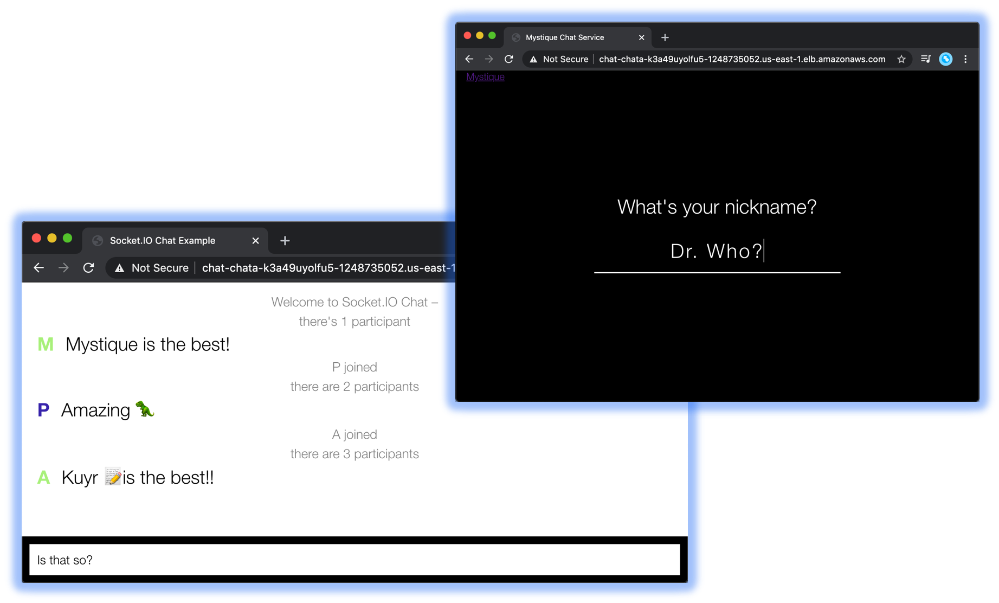

# Serverless Chat App using Fargate

Let us build a serverless chat application running in AWS Fargate.

1. ## Prerequisites

    This demo, instructions, scripts and cloudformation template is designed to be run in `us-east-1`. With few modifications you can try it out in other regions as well(_Not covered here_).

    - AWS CLI pre-configured - [Get help here](https://youtu.be/TPyyfmQte0U)

1. ## ⚙️ Setting up the environment

    - Get the application code

        ```bash
        git clone https://github.com/miztiik/fargate-chat-app.git
        cd fargate-chat-app
        ```

    - Update your AWS account numbers in the `cdk.json` file. Replace `YOUR-ACCOUNT-NUMBER` with your 12-digit account number.

1. ## 🚀 Deployment using AWS CDK

    If you have AWS CDK installed you can close this repository and deploy the stack with,

    ```bash
    # If you DONT have cdk installed
    npm install -g aws-cdk

    # Make sure you in root directory
    cd fargate-chat-app
    source .env/bin/activate
    pip install -r requirements.txt
    ```

    The very first time you deploy an AWS CDK app into an environment _(account/region)_, you’ll need to install a `bootstrap stack`, Otherwise just go aheadand   deploy using `cdk deploy`

    ```bash
    cdk bootstrap
    cdk deploy *
    ```

1. ## 🔬 Test the app

    The `cdk deploy` command should provide you the application load balancer url to access the web app. _You can get the same from cloudformation outputs or in the ALB page.

    You should be seeing something like this,
    

1. ## 🧹 CleanUp

    If you want to destroy all the resources created by the stack, Execute the below command to delete the stack, or _you can delete the stack from console as well_

    ```bash
    cdk destroy *
    ```

    This is not an exhaustive list, please carry out other necessary steps as maybe applicable to your needs.

## 👋 Buy me a coffee

Buy me a coffee ☕ through [Paypal](https://paypal.me/valaxy), _or_ You can reach out to get more details through [here](https://youtube.com/c/valaxytechnologies/about).

### 📚 References

1. [Source Repo](https://github.com/socketio/socket.io/tree/master/examples/chat)

1. [Docker Hub](https://hub.docker.com/repository/docker/mystique/fargate-chat-app)

### ℹ️ Metadata

**Level**: 200
